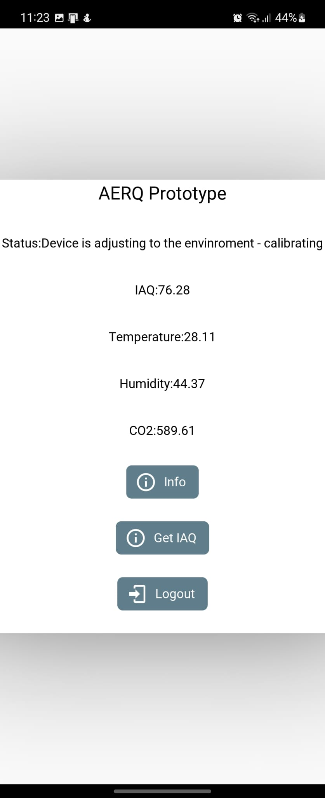

# AERQ - Indoor air quality monitor

## Introduction
This is the repository for AERQ, a USB-powered indoor air quality monitor using the
[here](/PCB/101-5/) Bosch BME688 sensor, running on mbed os.
It measures temperature, humidity, CO2 and IAQ using the BSEC 2.x library.
This data is then sent to The Things Network.


## PCB
This project features a custom 4 layer board using the Seeed E5-LoRa and the Bosch BME688.
Two variants of the board, one with a chip antenna ( Linx USP-410 ) and one with a u.Fl connector.

For the PCB with the integrated antenna, click here [here](/PCB/101-5/)


For the PCB with an external u.Fl connector, click [here](/PCB/101-3/)


Find the Seeed E5-LoRa module [here](https://www.seeedstudio.com/LoRa-E5-Wireless-Module-p-4745.html).


## Code

The code runs on mbed os 6.15.1 with the latest LoRaWan stack.
Insert your TTN credentials in mbed_app.json before running the application.

This code features a custom target on mbed os which configures the RF switch properly and adds a few macros for the board.

See mbed_app.json and custom_targets.json for more details.


Thanks to [hallard](https://github.com/hallard/LoRa-E5-Breakout) for adding the support in the official mbed os custom target repository.


## Payload decoder for TTN
The payload should provide the following result:


```
function Decoder(bytes, port) {
  // Decode plain text; for testing only 
  //var statusFromDevice = String.fromCharCode.apply(null, bytes.slice(12,13))
  
  let StringOfBytes = String.fromCharCode.apply(null, bytes);
  
  var temperature;
  var humidity;
  var iaq;
  var iaqAccuracy;
  var CO2;
  
  const Array = StringOfBytes.split(" ");
  temperature = Array[0];
  humidity = Array[1];
  statusFromDevice = Array[2];
  iaq = Array[3];
  CO2 = Array[4];
  
  var statusToDisplay;
  
  if (statusFromDevice == "0"){
      statusToDisplay = "Device warming up";
  } else if(statusFromDevice == "1")
  {
      statusToDisplay = "Device is adjusting to the envinroment - calibrating";
  }else if(statusFromDevice == "2")
  {
      statusToDisplay = "Environment has changed - re-calibrating";
  }
  else if(statusFromDevice == "2")
  {
      statusToDisplay = "Environment has changed - re-calibrating";
  }
  else if(statusFromDevice == "3")
  {
      statusToDisplay = "Device is calibrated and running";
  }
  else if(statusFromDevice == "4")
  {
      statusToDisplay = "Error communicating with the IAQ sensor. Critical";
  }
  
  
  return {
      Humidity: humidity,
      //IAQAccuracy:String.fromCharCode.apply(null, bytes.slice(12,13)),
      IAQ:iaq,
      CO2:CO2,
      Temperature:temperature,
      Status:statusToDisplay
  };
}
```

## Android application

A simple KivyMD app was made for Android to receive packets:




## Azure IoT Central

Data can also be parsed through Azure IoT Hub to the Azure IoT Central


